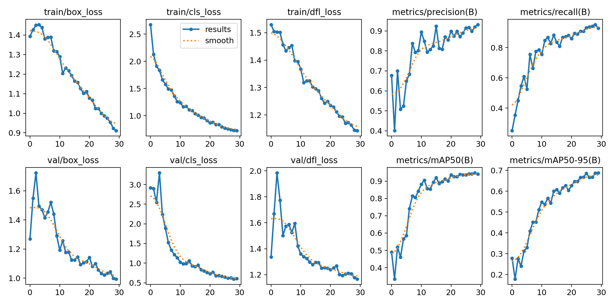
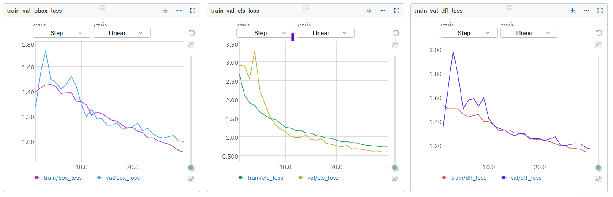
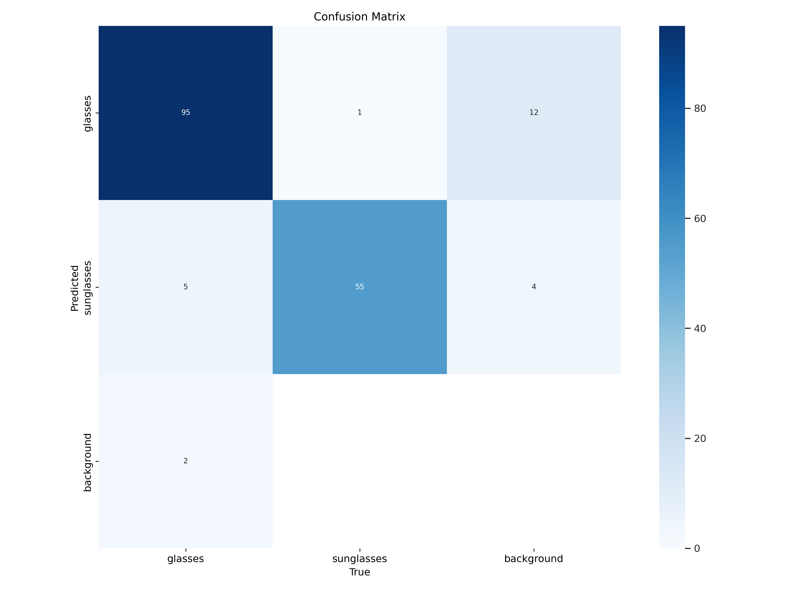

### **YOLOv8 Glasses and Sunglasses Detection Model**
This notebook is the documentation of the YOLO model trained on dataset for glasses and sunglasses.

### **Dataset Detail**
The dataset used to train this YOLOv8 model is a public dataset on  on [roboflow](https://universe.roboflow.com/it-3pwlf/glasses-detection-cqd8m). It consists of

- 857 train images
- 121 val images
- 246 test images

There are 2 type of classes in the dataset
- glasses
- sunglasses

And the sample distribution of these classes are as
- train:
    - glasses: 1157
    - sunglasses: 308
- val:
    - glasses: 102
    - sunglasses: 56
- test:
    - glasses: 148
    - sunglasses: 143


### **Training Configuration**

#### **Platform**

Model is trained on a Google Colab instance with Tesla T4 GPU and 15 GB of VRAM. Pytorch 2.0.0 and Python 3.9.16 used on the environment. 

#### **Model Configuration**
- The model is a YOLOv8 nano model with 3.2 million parameters, and pretrained on COCO dataset. During training it's finetuned with our custom dataset.

- Model input size is 640 x 640
#### **Epochs, LR and Optimizer**
Model is trained during 30 epochs with AdamW Optimizer and with initial LR 0.01
#### **Augmentation**
Standard Mosaic augmentation of YOLO is applied to the samples during training. Also, below default augmentations are applied.

- Blur(p=0.01, blur_limit=(3, 7))
- MedianBlur(p=0.01, blur_limit=(3, 7))
- ToGray(p=0.01)
- CLAHE(p=0.01, clip_limit=(1, 4.0), tile_grid_size=(8, 8))


### **Inference Pipeline Information**
YOLOv8 inference utility functions are combined under [inference_utils.py](inference_utils.py) module. Most of the preprocess and postprocess utils are remained as default or less modified. But they are separated from the predictor class, so they can now be used more flexibly.

Pytorch [model loader util](inference_utils.py#L21) is written custom. Also the model configuration is done under this util.

Image loader functions have been written custom. But also can be extended with adding a generator function that returns a tuple with the values  (`frame`, `out_path`, `fps`, `frame_size`).  FPS can be returned None if custom source is not a video (image folder etc.).

Result plotting and showing functions are also written custom. For this, a custom result format is used. It is a dictionary with `source` and `image_to_pred` fields. Image to pred's value is a dict of frame name to predictions, and finally, the predictions are list of dict, which has key value pairs of `bbox`, `conf`, `class_name`. The resulting dictionary is saved on current directory at the end of inference. The whole these utils are merged in a [pipeline](inference_utils.py#L234).
Inference can be performed as below example.
```python
from inference_utils import inference_pipeline
    inference_pipeline(model_ckpt_path="C:/Users/kadir/dev/ultralytics/yolov8-glasses-sunglasses.pt",
         device="cuda",
         source="test_video.mp4",
         confidence_threshold=0.25)
```

### **Model performance Evaluation**

The best saved checkpoint of this model is reaching 0.69 mAP50-95 for glasses class, and 0.688 mAP50-95 for the sunglasses class for the validation set. 

On the test subset, model reaches  0.712 and 0.745 mAP50-95 scores for glasses and sunglasses classes respectively. 

Despite the map scores seem sufficient, the real time webcam inference results show that model is suffering from class imbalance and lack of negative (background) samples in training set. Because especially in low confidence thresholds, model produce some FP glasses and sunglasses predictions even in a face without any glasses. But setting a higher threshold such as 0.4 or 0.5 fixes this problem.

Training metric graphs are as below:


Train and val loss metrics on same neptune.ai plot is as below.


Also the lack of negative samples can be seen in confusion matrix below.
As seen in the matrix, model is confusing the background and glasses.

